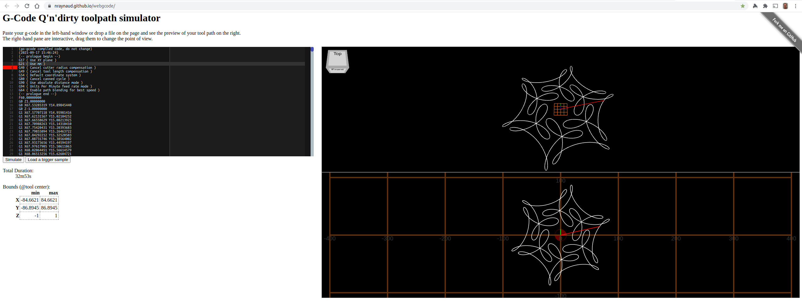

# go-gcode examples

Many thanks to https://nraynaud.github.io/webgcode/ for providing
the "G-Code Q'n'dirty toolpath simulator", which was used to
grab screenshots for the examples.

## ball-in-cube

## bezier

## canned

## cc-hole

## colors

## cutter

## cycloids

## edm-pro-box

## floret-vodel

## involute-gear

## text-fonts

## text-on-circle

## tool-compensate

## trochoidal

## varcs

## wheels

